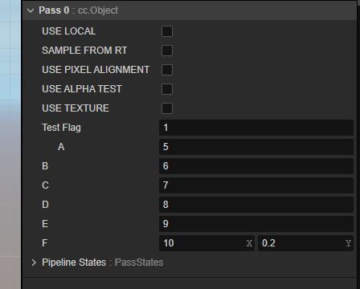

### 消融效果  2d
1.使用到了噪声贴图，通过uv坐标取到噪声贴图的颜色灰度值和一个消融阈值来确定是否显示颜色片段
2.给与一个边缘颜色，消融阈值 +0.05 然后设置为一个确定的颜色  是不是在0.05 这个范围内进行了颜色插值

### 自定义属性
自定义属性：
 property:
        testFlag: {value: 1}
        a: {value: 0.1, target: testVec.x, editor: {parent: testFlag}}
        b: {value: 0.1, target: testVec.y}
        c: {value: 0.1, target: testVec.z}
        d: {value: 0.1, target: testVec.w}
        e: {value: 0.1}
        f: {value: [0.1, 0.2]}   

 uniform CustomConstant { // 按照顺序，需要先放置 vec4 vec3 vec2 float int 。。。。
     vec4 testVec;
     vec2 f;
     float e;
     int testFlag;
     // bool testFlag; // 不能定义布尔类型
  };
